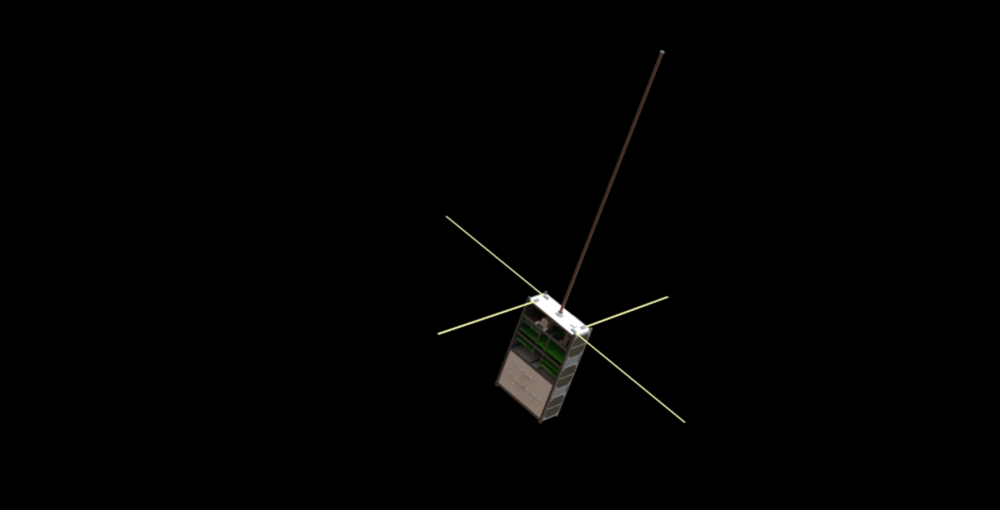
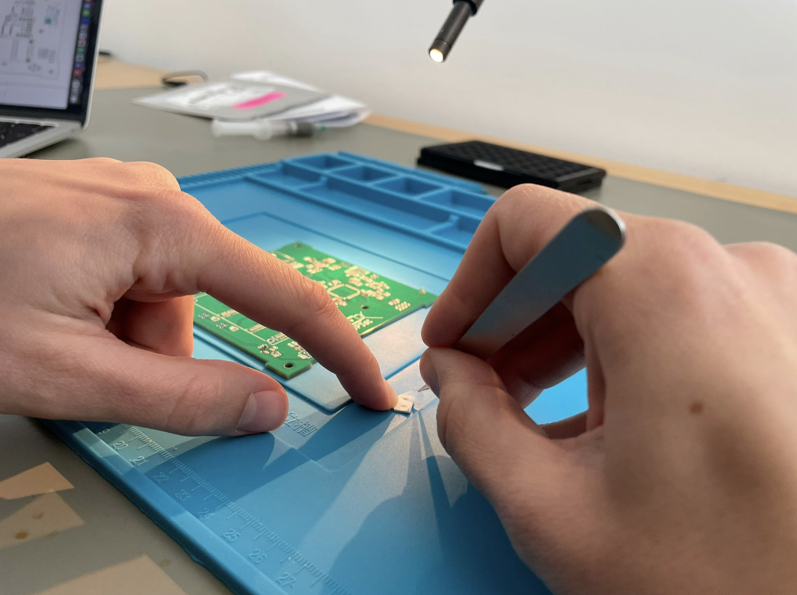
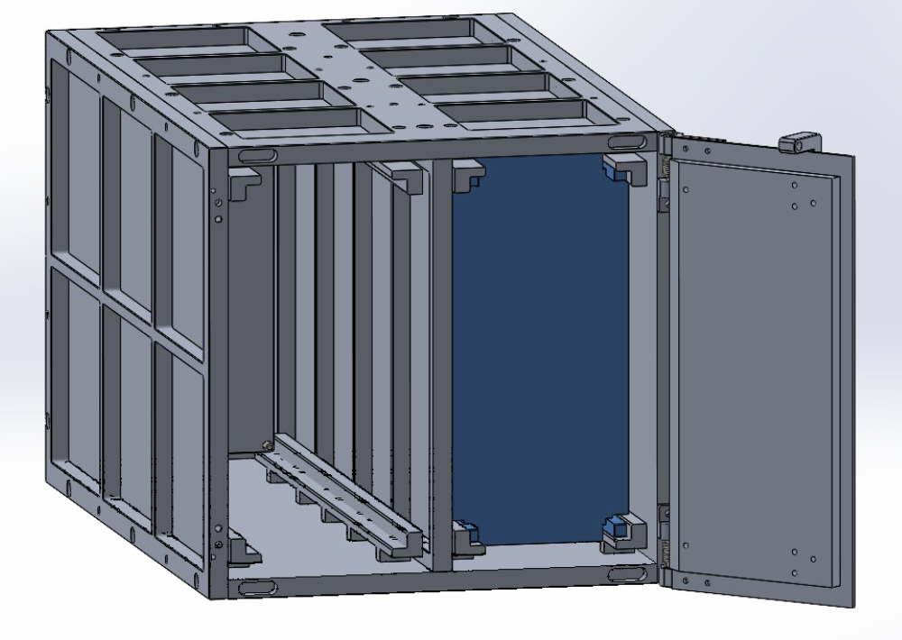

# Project Overview: Curium 5

The Curium 5 project is designed around the development of 6U CubeSats, using components primarily sourced from commercial manufacturers. We utilize a launch spot won at the [DLR microlauncher competition 2022](https://www.dlr.de/en/latest/news/2022/02/20220620_go-ahead-for-second-round-of-microlauncher-payload-competition). The mission aims to foster a profound technical comprehension and open development environment, instrumental in the creation of high-quality components at prices significantly below market rates. The knowledge and expertise gained from this endeavor will prove beneficial for future open-source satellite missions.

Lastly, the deployment of commercial hardware of consumer and industrial quality can demonstrate the feasibility and cost-effectiveness of these components for space missions. We are also considering involving external stakeholders in payload development. A collaboration with the German Aerospace Center and the University of Vienna will facilitate the integration of a novel, laser-based quantum computer, marking its inaugural deployment in space.

  <figure>
    
    <figcaption>PCB assembly</figcaption>
  </figure>
  <figure>
    
    <figcaption>dispenser design</figcaption>
  </figure>

## Project Goals

The Curium 5 CubeSat mission aims at pushing the limits of what's achievable in CubeSat development and production within a cost-effective framework. The project's key objectives include:

- Acquiring experience in designing and producing CubeSat buses with commercial components of consumer and industrial quality.
- Leveraging mostly passive gravity gradient attitude stabilization and active magnetorquers.
- Demonstrating the ability to generate and process data onboard.
- Using hardware and software based on UpSat, but customized to suit our needs.
- Utilizing the SatNOGS ground station network for uplink and downlink.

# Team

We are a team of six students: Paul (space engineering, TU Berlin), Jakob (space engineering, TU Berlin), Johann (business, HU Berlin), Johannes (engineering, TU Berlin), Toni (computer science, DLR), Marcus (computer science, Hasso-Plattner-Institue), Pujan (mechanical engineering, TU Berlin).

## Technical Specifications

Based on on [Upsat](https://nchronas.github.io/upsat_msc_thesis/#obc), [Qubik](https://gitlab.com/librespacefoundation/qubik) designs.

### Structure:
- Size: 4x 6U CubeSats (113 x 226 x 340mm)
- Weight: <8 Kg
- Every subsystem is independent and computer controlled (modularity)

### Electrical Power System (EPS)
- Solar cells: Monocrystalline Si cells mounted on the satellite body, which supply the CubeSat's systems and payloads with power.
- Power: minimum 2-5 W average for payload, higher burst loads possible
- Energy storage: Temperature resilient Lithium-Titanat or Lithium-Iron-Phosphate Battery

### Attitude Determination & Control (ADCS)
- Magnetorquer for detumbling

### Communication (Comm)
- Amateur radio bands for uplink and downlink, with a data transfer rate of up to 9.6 kbps
- Usage of ground station network SatNOGS
- Antenna: simple monopole antennas with orthogonal radiation patterns to achieve quasi-isotropic radiation properties.

### Data Handling (OBC)
- Computer: STM32F4 based

### Payload
- Sensors:
  - Temperature sensors
  - Cameras
  - IMU
  - Further scientific payload from DLR for the investigation of the behavior of a single-photon-based quantum chip

### Launch & Lifetime
- Launch vehicle: Vega 5 & RFA ONE
- Launch dates: December 23 & July 24
- Estimated lifespan: >3 months, targeted at multiple years depending on payload

### Deployer
- Design of a proprietary satellite deployer (ejection after rocket launch).
- Based on reliable electromechanical system

### OBC Prototype Production
- Deployer for RFA rocket
